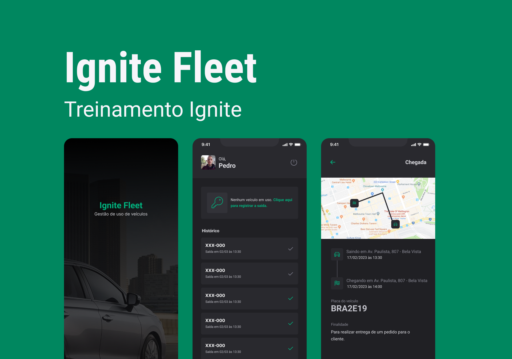

## 👨🏽‍💻 Stack
-  [ ] React Native
-  [ ] Typescript
-  [ ] Expo
-  [ ] Styled-Components
-  [ ] Login Social
-  [ ] Cloud MongoDB Atlas

## 🔖 Layout

Você pode visualizar o layout deste projeto através [desse link](https://www.figma.com/community/file/1233747170984378974/Ignite-Fleet).
Lembrando que é necessário ter uma conta no [Figma](http://figma.com/) para poder acessar.

## Executando o projeto
 Faça o clone deste projeto em seu computador e depois execute com o Expo: 
 
 ```bash
  git clone branch_url
  cd igniteFleet
  npm install
  npx expo run:android / npx expo run:ios
```
```
Lembrando que será necessária a criação de chaves de API no GPC (Google Cloud Console), para utilizar a funcionalidade de autenticação da aplicação.

```